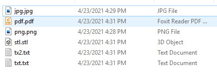
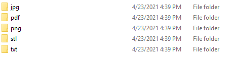

#  FILE SORTER
###  BEFORE

###  AFTER

---

## ABOUT
this is an automatic file sorter that will sort each file 
inside the directory that you will give it. it sorts them
by their file extensions and puts each file type into its
own folder.
---
## HOW TO USE
- First, input the exact location of the file you want to sort.
- Then just wait for it to finish and... DONE. now all of your
  files are sorted!
- just remember that the script won't go into other directories
  while inside the files. so any directories won't be touched.

# ENJOY ❤
  
  
