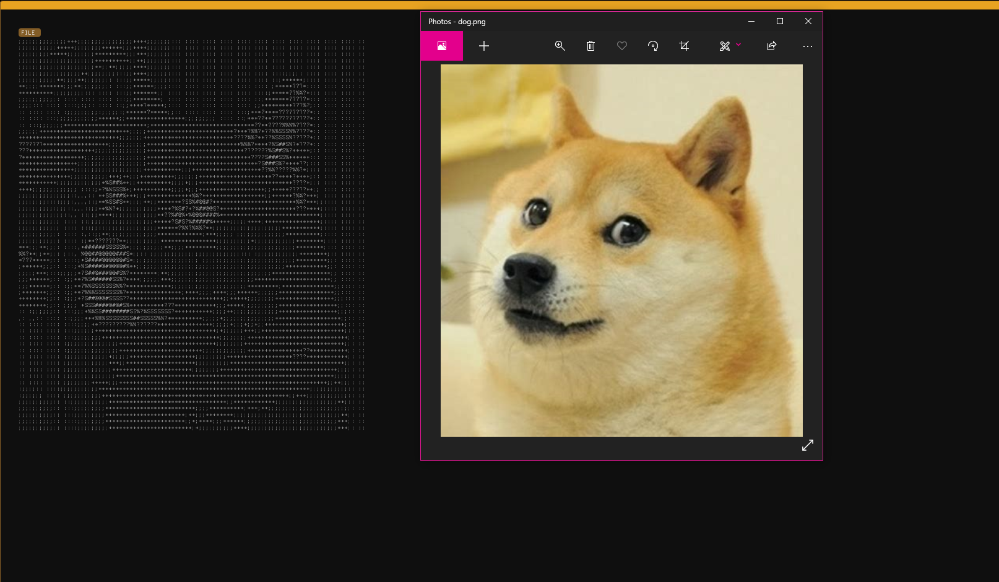

#  PNG TO ASCII

> This image shows the result of the program

---

## Description

This program takes a .png type file and transforms it into text that looks
like the image. it got its own GUI

#### STEPS

- open the program
- click on the "file" button
- choose the file you want to transform into text
- THERE! you got a text that looks like the original image
